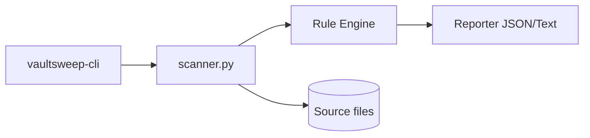
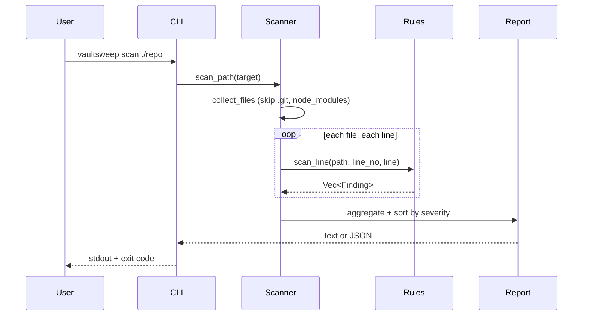

# Architecture: VaultSweep

**Version:** 1.0  
**Last updated:** 2026-06-29

## 1. System Overview

VaultSweep is a Python CLI that walks repository files, applies regex-based detection rules, and emits structured findings for local dev and CI pipelines.



**Ecosystem position:** RytScan catches contract logic bugs; ShieldScan catches web vulns; VaultSweep catches **leaked credentials** before they reach main.

## 2. Package Layout

| Path | Role |
|---|---|
| `vaultsweep/cli.py` | Argparse CLI (`scan`, `rules`) |
| `vaultsweep/scanner.py` | File walker + orchestration |
| `vaultsweep/reporter.py` | Text/JSON formatting + exit codes |
| `vaultsweep/models.py` | `Finding`, `ScanReport`, `Severity` |
| `vaultsweep/rules/` | Pluggable detection rules |
| `fixtures/` | Leaky + clean regression repos |
| `tests/` | Pytest suite |

## 3. Scan Pipeline



### 3.1 File Discovery

- Recursively walks target directory
- Skips: `.git`, `venv`, `node_modules`, `target`, `__pycache__`
- Scans: `.rs`, `.toml`, `.env`, `.py`, `.ts`, `.js`, `.yaml`, `.json`, `.sh`, `.md`, etc.
- Skips binary extensions: `.wasm`, `.png`, `.db`, etc.

### 3.2 Rule Interface

Each rule implements `scan_line(file, line_no, line) -> list[Finding]` and exposes `RuleMeta` (id, name, severity, remediation).

Phase 1 uses line-based regex. Phase 3 adds entropy analysis.

## 4. Rule Catalog (Phase 1)

| ID | Severity | Detects |
|---|---|---|
| `STELLAR-001` | Critical | Stellar secret key (`S` + 55 base32 chars) |
| `MNEMONIC-001` | Critical | 12+ word BIP39 mnemonic phrase |
| `API-001` | Critical | Anthropic `sk-ant-api...` keys |
| `API-002` | Critical | GitHub `ghp_` tokens |
| `API-003` | Critical | GitHub `gho_` OAuth tokens |
| `API-004` | High | AWS `AKIA...` access keys |
| `API-005` | Medium | Generic `api_key=` assignments |
| `DEFAULT-001` | High | Default creds (`changeme`, `password`, etc.) |
| `RPC-001` | High | RPC URLs with embedded auth or query tokens |

## 5. Report Model

```json
{
  "tool": "VaultSweep",
  "version": "0.1.0",
  "target": "fixtures/leaky-repo",
  "summary": {
    "files_scanned": 1,
    "rules_run": 9,
    "findings": 6,
    "by_severity": { "critical": 4, "high": 2, "medium": 0, "low": 0 }
  },
  "findings": [ ... ]
}
```

Exit codes:

| Code | Meaning |
|---|---|
| 0 | Scan complete, no findings ≥ `--fail-on` threshold |
| 1 | Findings at or above `--fail-on` severity |
| 2 | Target not found / usage error |

## 6. CI Integration

```bash
vaultsweep scan . --fail-on high
```

```yaml
# .github/workflows/ci.yml
- run: vaultsweep scan . --fail-on high
```

## 7. Phase Roadmap

| Phase | Focus |
|---|---|
| 1 ✅ | CLI, rules, fixtures, CI |
| 2 | Pre-commit hook + GitHub Action |
| 3 | Entropy + advanced Stellar patterns |
| 4 | Git staged/history scan |
| 5 | Dashboard + org policies |
| 6 | BreachDirect unified CLI |

---

**See also:** [prd.md](./prd.md)
